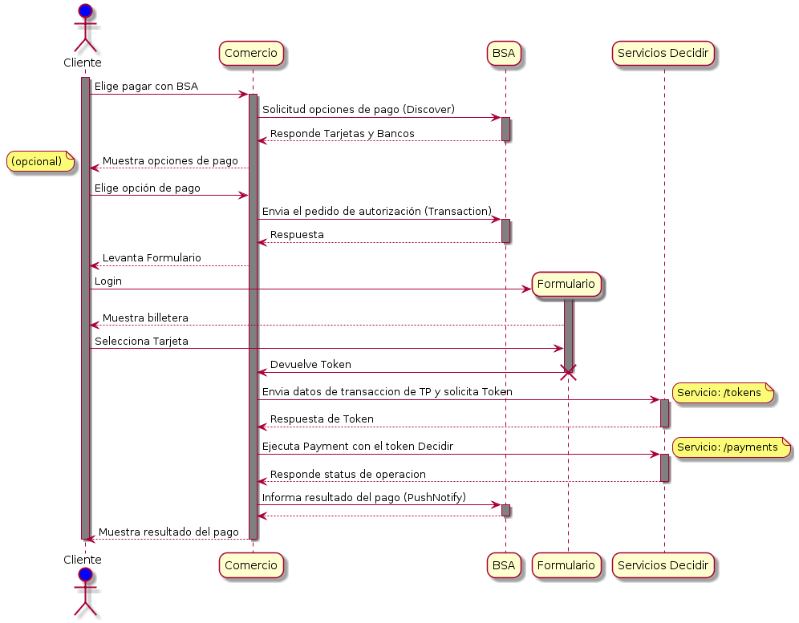
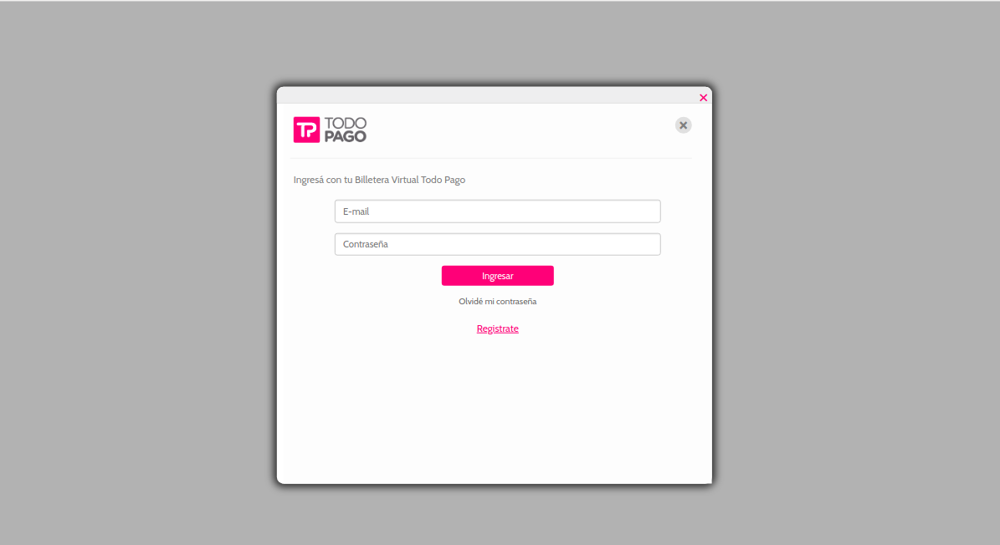

## Integracion de BSA con Decidir

Este documento explicara como integrar BSA con Decidir utilizando .NET.
El siguiente diagrama explica el flujo de la implementación.


### Diagrama de secuencia


Etapas de integración BSA con Decidir
+ [Servicio Transaction](#transaction)
+ [Formulario TP de pago](#formtp)
+ [Solicitud de Token de Pago para BSA en Decidir](#tokendecidir)
+ [Ejecución del Pago para BSA en Decidir](#pagodecidir)
+ [Notificacion Push](#pushnotification)

####  Requerimientos
Tanto Todopago como Decidir tienen disponible una SDK de NET que permite utilizar los servicios requeridos. Se pueden obtener desde:
+ Todopago SDK: https://github.com/TodoPago/SDK-NET-BilleteraVirtualGateway
+ Decidir SDK: https://github.com/decidir/sdk-.net-webtx-v2 

Para operar en Todopago es necesario tener credenciales de Todopago, Nro. de Comercio (Merchant ID) y Credenciales (API Keys). 
Por parte de Decidir es necesario tener dada de alta una tienda y obtener las credenciales "Publickey" y Privatekey.

<a name="transaction"></a>
### Servicio Transaction
El primer paso es registrar una transaccion con el servicio [Transaction](#https://github.com/TodoPago/SDK-NET-BilleteraVirtualGateway#bvg-transaction) del  SDK de Todopago. Este requiere el Merchant y API Key de Todopago.


<table>
<tr><th>Nombre del campo</th><th>Required/Optional</th><th>Data Type</th><th>Comentarios</th></tr>
<tr><td>security</td><td>Required</td><td>String</td><td>Authorization que deberá contener el valor del api key de la cuenta del vendedor. Ejemplo: TODOPAGO 3560b2f82b0f4860b8360dcd693058a9</td></tr>
<tr><td>operationDatetime</td><td>Required</td><td>String</td><td>Fecha Hora de la invocacion en Formato yyyyMMddHHmmssSSS</td></tr>
<tr><td>remoteIpAddress</td><td>Required</td><td>String</td><td>IP desde la cual se envía el requerimiento</td></tr>
<tr><td>merchant</td><td>Required</td><td>String</td><td>ID de cuenta del vendedor. Ejemplo: 75087</td></tr>
<tr><td>operationType</td><td>Optional</td><td>String</td><td>Valor fijo definido para esta operatoria de integración</td></tr>
<tr><td>operationID</td><td>Required</td><td>String</td><td>ID de la operación en el eCommerce</td></tr>
<tr><td>currencyCode</td><td>Required</td><td>String</td><td>Valor fijo 32</td></tr>
<tr><td>concept</td><td>Optional</td><td>String</td><td>Especifica el concepto de la operación</td></tr>
<tr><td>amount</td><td>Required</td><td>String</td><td>Formato 999999999,99</td></tr>
<tr><td>availablePaymentMethods</td><td>Optional</td><td>Array</td><td>Array de Strings obtenidos desde el servicio de descubrimiento de medios de pago. Lista de ids de Medios de Pago habilitados para la transacción. Si no se envía están habilitados todos los Medios de Pago del usuario.</td></tr>
<tr><td>availableBanks</td><td>Optional</td><td>Array</td><td>Array de Strings obtenidos desde el servicio de descubrimiento de medios de pago. Lista de ids de Bancos habilitados para la transacción. Si no se envía están habilitados todos los bancos del usuario. Ejemplo: 42</td></tr>
<tr><td>buyerPreselection</td><td>Optional</td><td>BuyerPreselection</td><td>Preselección de pago del usuario. Ejemplo: 1</td></tr>
<tr><td>sdk</td><td>Optional</td><td>String</td><td>Parámetro de versión de API</td></tr>
<tr><td>sdkversion</td><td>Optional</td><td>String</td><td>Parámetro de versión de API</td></tr>
<tr><td>lenguageversion</td><td>Optional</td><td>String</td><td>Parámetro de versión de API</td></tr>
<tr><td>pluginversion</td><td>Optional</td><td>String</td><td>Parámetro de versión de API</td></tr>
<tr><td>ecommercename</td><td>Optional</td><td>String</td><td>Parámetro de versión de API</td></tr>
<tr><td>ecommerceversion</td><td>Optional</td><td>String</td><td>Parámetro de versión de API</td></tr>
<tr><td>cmsversion</td><td>Optional</td><td>String</td><td>Parámetro de versión de API</td></tr>
</table>


####  Ejemplo de implementacion
```C#
    Dictionary<string, Object> generalData = new Dictionary<string, Object>();
    generalData.Add(ElementNames.BSA_MERCHANT, "41702");
    generalData.Add(ElementNames.BSA_SECURITY, "TODOPAGO 8A891C0676A25FBF052D1C2FFBC82DEE");
    generalData.Add(ElementNames.BSA_OPERATION_DATE_TIME, "20170308041300");
    generalData.Add(ElementNames.BSA_REMOTE_IP_ADDRESS, "127.0.0.1");

    Dictionary<string, Object> operationData = new Dictionary<string, Object>();
    operationData.Add(ElementNames.BSA_OPERATION_TYPE, "Compra");
    operationData.Add(ElementNames.BSA_OPERATION_ID, "12345");
    operationData.Add(ElementNames.BSA_CURRENCY_CODE, "032");
    operationData.Add(ElementNames.BSA_CONCEPT, "compra");
    operationData.Add(ElementNames.BSA_AMOUNT, "10,99");

    List<string> availablePaymentMethods = new List<string>();
    availablePaymentMethods.Add("1");
    availablePaymentMethods.Add("42");
    operationData.Add(ElementNames.BSA_AVAILABLE_PAYMENT_METHODS, availablePaymentMethods);

	List<string> availableBanks = new List<string>();
	availableBanks.Add("6");
	availableBanks.Add("24");
	availableBanks.Add("29");
	operationData.Add(ElementNames.BVG_AVAILABLE_BANK, availableBanks);

    Dictionary<string, Object> technicalData = new Dictionary<string, Object>();
    technicalData.Add(ElementNames.BSA_SDK, "Net");
    technicalData.Add(ElementNames.BSA_SDK_VERSION, "1.0");
    technicalData.Add(ElementNames.BSA_LANGUAGE_VERSION, "3.5");
    technicalData.Add(ElementNames.BSA_PLUGIN_VERSION, "1.0");
    technicalData.Add(ElementNames.BSA_ECOMMERCE_NAME, "Bla");
    technicalData.Add(ElementNames.BSA_ECOMMERCE_VERSION, "3.1");
    technicalData.Add(ElementNames.BSA_CM_VERSION, "2.4");

    TransactionBVG trasactionBVG = new TransactionBVG(generalData, operationData, technicalData);
```
####  Respuesta

La respuesta tiene el atributo **publicRequestKey**, este requerido en el formulario de Todopago.

```C#
Dictionary<string, Object>()
		{  publicRequestKey = "0e6d1f45-a85e-480f-a98f-5f18cf881b9b", //string(36)
		   merchantId = "75087", //string(36)
   		   channel = "11" //string(2)
	    }
```
<a name="formtp"></a>
### Formulario TP de pago

Luego de Transaction se debe utilizar formulario provisto por Todopago, este se puede implementar como se indica en el ejemplo. 
Para funcionar requiere ingresar en el atributo "publicKey" el **publicRequestKey** que respondió el servicio "Transaction".

Campo       | Descripción           | Tipo de dato | Ejemplo
------------|-----------------------|--------------|--------
publicKey   | publicKey: "requestpublickey",  | String | 066aee1a-c36b-45f2-b827-d20a0d807284

#### Endpoints:
+ Ambientes desarrollo: https://forms.integration.todopago.com.ar/resources/TPBSAForm.js
+ Ambiente Produccion: https://forms.todopago.com.ar/resources/TPBSAForm.min.js

####  Ejemplo de implementacion
```html

<html>
    <head>
        <title>Formulario de pago TP</title>
        <meta charset="UTF-8">
        <script src="https://forms.integration.todopago.com.ar/resources/TPBSAForm.js"></script>
        <link rel="stylesheet" type="text/css" href="css/styles.css">
        <script type="text/javascript">
        </script>
    </head>
	<body>
	    <script>
		var success = function(data) {
		    console.log(data);
		};
		var error = function(data) {
		    console.log(data);
		};
		var validation = function(data) {
		    console.log(data);
		}
		window.TPFORMAPI.hybridForm.initBSA({
		    publicKey: "requestpublickey",
		    merchantAccountId: "merchant",
		    callbackCustomSuccessFunction: "success",
		    callbackCustomErrorFunction: "error",
		    callbackValidationErrorFunction: "validation"
		});
	    </script>
	</body>
</html>
```
El formulario mostrara una ventana de login para ingresar el usuario de billetera de la cuenta de Todopago



####  Respuesta
Si la compra fue aprobada el formulario devolverá un JSON con la siguiente estructura.
```html
{
"ResultCode":1,
"ResultMessage":"El medio de pago se selecciono correctamente",
"Action":"accion"
"SessionId":"DB37611F-6510-2423-1223-1C4F76F04A0D",
"IdCuenta":"41703",
"Token":"4507991692027787",
"MerchantAccountId": "46523",
"BankId":"17",
"CardNumberBin": 450799,
"FourLastDigitsOfCardNumber":"7783",
"PaymentMethodID":"42",
"SecurityCodeCheck": "false",
"SelectorClaveFlag": "1",
"TokenDate": "20180427",
"TokenizationFlag": "false",
"DatosAdicionales": {
	"tipoDocumento": "DNI",
	"numeroDocumento": "45998745",
	"generoCuentaCompradora": "M",
	"nombre": "Comprador",
	"apellido": "BSA",
  	"permiteObtenerMP": false
},
"VOLATILE_ENCRYPTED_DATA": "YRfrWggICAggsF0nR6ViuAgWsPr5ouR5knIbPtkN+yntd7G6FzN/Xb8zt6+QHnoxmpTraKphZVHvxA=="
"BSA":true
} 
```
> **Nota:** Los campos queridos por decidir son el "Token" y "VOLATILE_ENCRYPTED_DATA".

<a name="tokendecidir"></a>
###  Solicitud de Token de Pago para BSA en Decidir

Para implementar los servicios de Decidir en NET se debe descargar la ultima versión del SDK [SDK NET Decidir](https://github.com/decidir/sdk-.net-v2). Ademas es necesario ingresar las claves publicas y privadas provistas por Decidir.
Luego de importar el SDK en el proyecto e instanciar el SDK, se debe llamar el servicio **tokens** para obtener el token de pago de Decidir.

```C#
string privateApiKey = "92b71cf711ca41f78362a7134f87ff65";
string publicApiKey = "e9cdb99fff374b5f91da4480c8dca741";

//AMBIENTE_SANDBOX
//AMBIENTE_PRODUCCION
//Para el ambiente de desarrollo
DecidirConnector decidir = new DecidirConnector(Ambiente.AMBIENTE_SANDBOX, privateApiKey, publicApiKey);

Tokens tokensData = new Tokens();

tokensData.public_token = "4507994025297787";
tokensData.volatile_encrypted_data = "YRfrWggICAggsF0nR6ViuAgWsPr5ouR5knIbPtkN+yntd7G6FzN/Xb8zt6+QHnoxmpTraKphZVHvxA==";
tokensData.public_request_key = "12345678";
tokensData.issue_date = "123123123123";
tokensData.flag_security_code = "0";
tokensData.flag_tokenization = "0";
tokensData.flag_selector_key = "1";
tokensData.flag_pei = "1";
tokensData.card_holder_name = "Horacio";
tokensData.card_holder_identification.type = "single";
tokensData.card_holder_identification.number = "23968498";
tokensData.fraud_detection.device_unique_identifier = "12345";

try
{
    PaymentResponse resultPaymentResponse = decidir.Tokens(tokensData);
}
catch (ResponseException)
{

}
```
#### Respuesta:
```C#


```
> **Nota:** El servicio Payment requiere el token generado que devuelve el campo **id** ".

<a name="pagodecidir"></a>
### Ejecución del Pago para BSA en Decidir

Luego de generar el Token de pago con el servicio anterior se deberá ejecutar la solicitud de pago de la siguiente manera. Ingresando en "token" el **token** de pago previamente generado en el servicio anterior.

#### Ejemplo:

```C#
string privateApiKey = "92b71cf711ca41f78362a7134f87ff65";
string publicApiKey = "e9cdb99fff374b5f91da4480c8dca741";

//AMBIENTE_SANDBOX
//AMBIENTE_PRODUCCION
//Para el ambiente de desarrollo
DecidirConnector decidir = new DecidirConnector(Ambiente.AMBIENTE_SANDBOX, privateApiKey, publicApiKey);

Payment payment = new Payment();

payment.site_transaction_id = "[ID DE LA TRANSACCIÓN]"; //string unico que identifica la transaccion
payment.payment_method_id = 1;
payment.token = "[TOKEN DE PAGO]"; //token de pago provisto por el servicio tokens
payment.bin = "450799";
payment.amount = 2000;
payment.currency = "ARS";
payment.installments = 1;
payment.description = "";
payment.payment_type = "single";
payment.establishment_name = "single";

try
{
    PaymentResponse resultPaymentResponse = decidir.Payment(payment);
}
catch (ResponseException)
{
}

```

#### Respuesta:
```C#


```
> **Nota:** Los datos necesario para el servicio Push son **status**, **ticket**, **authorization**.

<a name="pushnotification"></a>
### Notification Push

Registra la fiscalización de una transacción. El método retorna el objeto NotificationPushBVG con el resultado de la notificación. Para funcionar requiere los siguientes campo:
<table>
<tr><th>Nombre del campo</th><th>Required/Optional</th><th>Data Type</th><th>Comentarios</th></tr>
<tr><td>Security</td><td>Required</td><td>String</td><td>Authorization que deberá contener el valor del api key de la cuenta del vendedor (Merchant). Este dato viaja en el Header HTTP.
Ejemplo: TODOPAGO 3560b2f82b0f4860b8360dcd693058a9 </td></tr>
<tr><td>Merchant</td><td>Required</td><td>String</td><td>ID de cuenta del comercio de Todopago</td></tr>
<tr><td>RemoteIpAddress</td><td>Optional</td><td>String</td><td>IP desde la cual se envía el requerimiento</td></tr>
<tr><td>PublicRequestKey</td><td>Required</td><td>String</td><td>El publicRequestKey se obtiene en la respuesta del servicio Transaction. Ejemplo:  710268a7-7688-c8bf-68c9-430107e6b9da</td></tr>
<tr><td>OperationName</td><td>Required</td><td>String</td><td>Valor que describe la operación a realizar, debe ser fijo entre los siguientes valores: “Compra”, “Devolucion” o “Anulacion”</td></tr>
<tr><td>ResultCodeMedioPago</td><td>Optional</td><td>String</td><td>Código de respuesta de la operación propocionado por el medio de pago</td></tr>
<tr><td>ResultCodeGateway</td><td>Optional</td><td>String</td><td>Código de respuesta de la operación propocionado por el gateway</td></tr>
<tr><td>idGateway</td><td>Optional</td><td>String</td><td>Id del Gateway que procesó el pago. Si envían el resultCodeGateway, es obligatorio que envíen este campo. Ejemplo: 8</td></tr>
<tr><td>ResultMessage</td><td>Optional</td><td>String</td><td>Detalle de respuesta de la operación.</td></tr>
<tr><td>OperationDatetime</td><td>Required</td><td>String</td><td>Fecha Hora de la operación en el comercio en Formato yyyyMMddHHmmssMMM</td></tr>
<tr><td>TicketNumber</td><td>Optional</td><td>String</td><td>Numero de ticket generado, este valor se obtiene desde la respuesta del servicio de pago de Decidir</td></tr>
<tr><td>CodigoAutorizacion</td><td>Optional</td><td>String</td><td>Codigo de autorización de la operación, se obtiene desde la respuesta del servicio de pago de Decidir </td></tr>
<tr><td>CurrencyCode</td><td>Required</td><td>String</td><td>Valor fijo 32</td></tr>
<tr><td>OperationID</td><td>Required</td><td>String</td><td>ID de la operación en el eCommerce</td></tr>
<tr><td>Amount</td><td>Required</td><td>String</td><td>Formato 999999999,99</td></tr>
<tr><td>FacilitiesPayment</td><td>Required</td><td>String</td><td>Formato 99</td></tr>
<tr><td>Concept</td><td>Optional</td><td>String</td><td>Especifica el concepto de la operación dentro del ecommerce</td></tr>
<tr><td>PublicTokenizationField</td><td>Required</td><td>String</td><td>4507991692027787, este valor se obtiene en la respuesta del formulario de pago de Todopago</td></tr>
<tr><td>CredentialMask</td><td>Optional</td><td>String</td><td>4507XXXXXXXX4905,  corresponsde a los primeros cuatro numeros de la tarjeta seguido por 8 X y los ultimos cuatro numeros de la tarjeta</td></tr>
</table>


#### Ejemplo:

```C#
BvgConnector connector = new BvgConnector(endpoint, headers);
	Dictionary<string, Object> generalData = new Dictionary<string, Object>();
	generalData.Add(ElementNames.BVG_MERCHANT, "41702");
	generalData.Add(ElementNames.BVG_SECURITY, "TODOPAGO 8A891C0676A25FBF052D1C2FFBC82DEE");
	generalData.Add(ElementNames.BVG_REMOTE_IP_ADDRESS, "192.168.11.87");
	generalData.Add(ElementNames.BVG_PUBLIC_REQUEST_KEY, "f50208ea-be00-4519-bf85-035e2733d09e");
	generalData.Add(ElementNames.BVG_OPERATION_NAME, "Compra");

	Dictionary<string, Object> operationData = new Dictionary<string, Object>();
	operationData.Add(ElementNames.BVG_RESULT_CODE_MEDIOPAGO, "-1");
	operationData.Add(ElementNames.BVG_RESULT_CODE_GATEWAY, "-1");
	operationData.Add(ElementNames.BVG_ID_GATEWAY, "8");
	operationData.Add(ElementNames.BVG_RESULT_MESSAGE, "Aprobada");
	operationData.Add(ElementNames.BVG_OPERATION_DATE_TIME, "201607040857364");
	operationData.Add(ElementNames.BVG_TICKET_MUNBER, "7866463542424");
	operationData.Add(ElementNames.BVG_CODIGO_AUTORIZATION, "455422446756567");
	operationData.Add(ElementNames.BVG_CURRENCY_CODE, "032");
	operationData.Add(ElementNames.BVG_OPERATION_ID, "1234");
	operationData.Add(ElementNames.BVG_CONCEPT, "compra");
	operationData.Add(ElementNames.BVG_AMOUNT, "10,99");
	operationData.Add(ElementNames.BVG_FACILITIES_PAYMENT, "03");

	Dictionary<string, Object> tokenizationData = new Dictionary<string, Object>();
	tokenizationData.Add(ElementNames.BVG_PUBLIC_TOKENIZATION_FIELD, "sydguyt3e862t76ierh76487638rhkh7");
	tokenizationData.Add(ElementNames.BVG_CREDENTIAL_MASK, "4510XXXXX00001");

    NotificationPushBVG notificationPushBVG = new NotificationPushBVG(generalData, operationData, tokenizationData);


try{

    trasactionBVG = connector.transaction(NotificationPushBVG);
	Dictionary<string, Object> dic = trasactionBVG.toDictionary();

}catch (EmptyFieldException ex){
    Console.WriteLine(ex.Message);
} catch (ResponseException ex) {
    Console.WriteLine(ex.Message);
} catch (ConnectionException ex) {
    Console.WriteLine(ex.Message);
}

```
#### Respuesta:
```C#

Dictionary<string, Object>() = notificationPushBVG.toDictionary();
		{  statusCode = -1, //string(2)
           statusMessage = OK //string(2)
	    }

```

